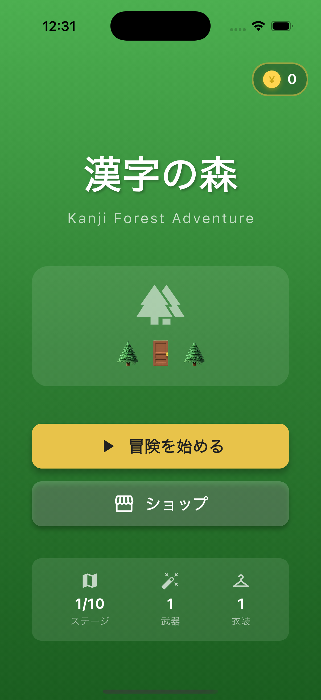
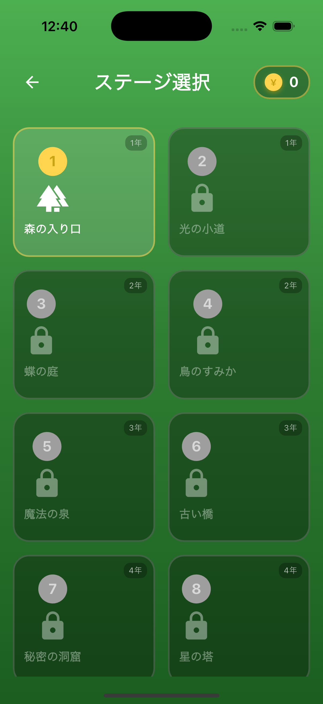
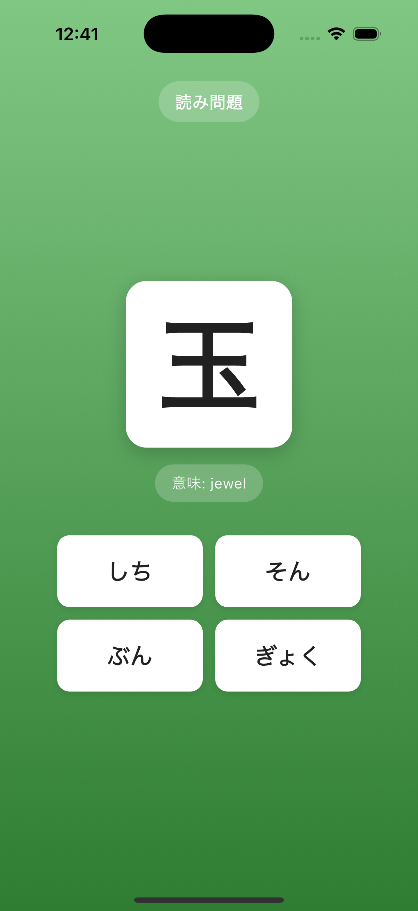
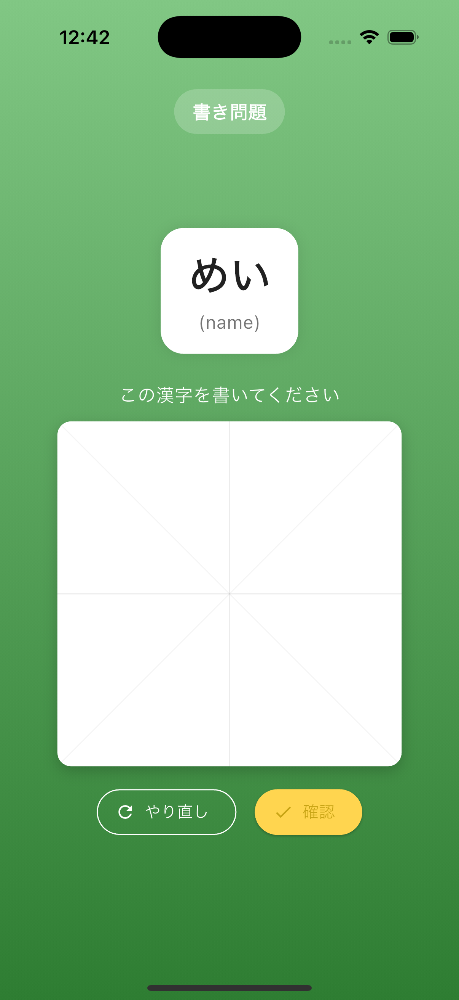

# 漢字の森 (Kanji Forest)

A kanji learning game for kids, built with Flutter.

## Screenshots

<p align="center">
  
  
  
  
</p>

---

## English

### About

**漢字の森** (Kanji no Mori / Kanji Forest) is a fun educational game designed to help children learn Japanese kanji characters through adventure and play.

This project was created as a father-son collaboration:
- **Game concept & design**: Main idea from my 8-year-old son
- **Tech advisor**: Me (Dad)
- **Specification**: Written with help from ChatGPT
- **Implementation**: Built using Claude Code

### Features

- **10 Forest-themed Stages** - Progress through magical forest doors
- **Kanji Questions** - Reading (multiple choice) and Writing (draw on canvas)
- **Action Battle System** - Real-time Attack/Shield/Jump timing battles against bosses
- **Coin Economy** - Earn coins for correct answers
- **Shop System** - Buy weapons, costumes, and decorations
- **Grade 1-6 Kanji** - All 1,006 elementary school kanji (教育漢字)

### How to Play

1. Select a stage from the forest map
2. Answer kanji questions by choosing readings or drawing characters
3. Defeat the boss using action timing (Attack, Shield, Jump)
4. Earn coins and unlock new stages!

### Tech Stack

- Flutter / Dart
- Riverpod (State Management)
- Hive (Local Storage)

### Build & Run

```bash
flutter pub get
flutter run
```

---

## 日本語

### このアプリについて

**漢字の森**は、子どもたちが冒険と遊びを通じて漢字を楽しく学べる教育ゲームです。

このプロジェクトは親子のコラボレーションで作りました：
- **ゲームコンセプト・デザイン**: 8歳の息子のアイデア
- **テックアドバイザー**: 父（私）
- **仕様書**: ChatGPTの助けを借りて作成
- **実装**: Claude Codeを使って開発

### 特徴

- **森をテーマにした10ステージ** - 魔法の扉を通って冒険
- **漢字問題** - 読み問題（選択式）と書き問題（手書き入力）
- **アクションバトル** - アタック・シールド・ジャンプのタイミングバトル
- **コインシステム** - 正解でコインを獲得
- **ショップ** - 武器、衣装、装飾を購入
- **小学1〜6年の漢字** - 教育漢字1,006文字を完全収録

### 遊び方

1. 森のマップからステージを選ぶ
2. 読みを選ぶか、漢字を書いて問題に答える
3. アクションタイミングでボスを倒す（アタック、シールド、ジャンプ）
4. コインを集めて新しいステージをアンロック！

### 技術スタック

- Flutter / Dart
- Riverpod（状態管理）
- Hive（ローカルストレージ）

### ビルド・実行

```bash
flutter pub get
flutter run
```

---

## License

MIT

## Data Sources

Kanji data (`assets/data/kanji.json`) is compiled from official sources:

| Data | Source |
|------|--------|
| Kanji list (1,006 字) | [MEXT 学習指導要領](https://www.mext.go.jp/a_menu/shotou/new-cs/youryou/syo/koku/001.htm) |
| Readings & Meanings | [KANJIDIC2](http://www.edrdg.org/wiki/index.php/KANJIDIC_Project) by EDRDG |

See [.dev/data/kanji-data-sources.md](.dev/data/kanji-data-sources.md) for details.

## Acknowledgments

- Game concept created by my 8-year-old son
- Specification written with [ChatGPT](https://chatgpt.com)
- Implemented with [Claude Code](https://claude.ai/claude-code)
- Kanji data from [EDRDG](http://www.edrdg.org/) (Electronic Dictionary Research and Development Group)
